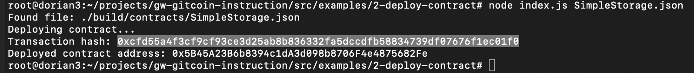

## 1. A screenshot of the console output immediately after you have successfully deployed a smart contract.

## 2. The transaction hash from the contract deployment (in text format).
0xcfd55a4f3cf9cf93ce3d25ab8b836332fa5dccdfb58834739df07676f1ec01f0
## 3. The deployed contract address from the contract deployment (in text format).
0x5B45A23B6b8394c1dA3d098b8706F4e4875682Fe
