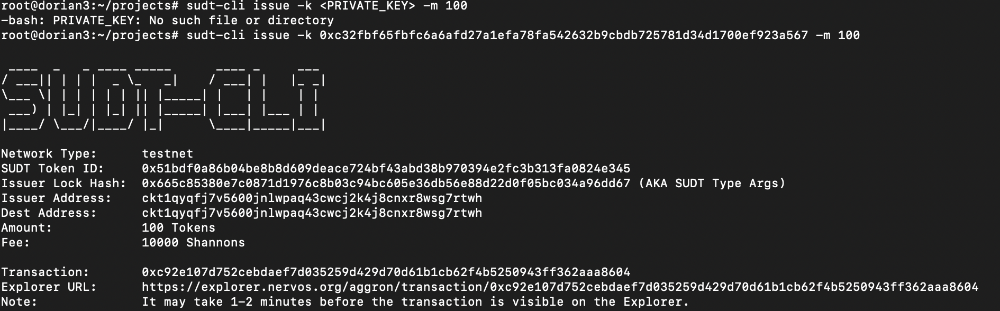
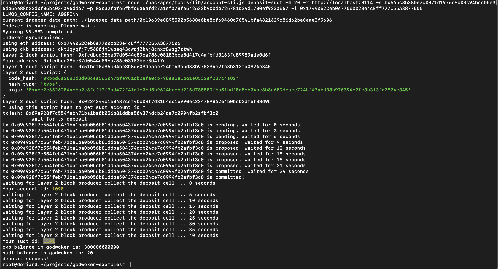

## 1. A link to the Layer 1 address you funded on the Testnet Explorer.
[https://explorer.nervos.org/aggron/address/ckt1qyqfj7v5600jnlwpaq43cwcj2k4j8cnxr8wsg7rtwh](https://explorer.nervos.org/aggron/address/ckt1qyqfj7v5600jnlwpaq43cwcj2k4j8cnxr8wsg7rtwh)
## 2. A screenshot of the console output immediately after using sudt-cli to create your SUDT tokens on Layer 1.

## 3. A link to the transaction ID created by sudt-cli on the Testnet Explorer.
[https://explorer.nervos.org/aggron/transaction/0xc92e107d752cebdaef7d035259d429d70d61b1cb62f4b5250943ff362aaa8604](https://explorer.nervos.org/aggron/transaction/0xc92e107d752cebdaef7d035259d429d70d61b1cb62f4b5250943ff362aaa8604)
## 4. A screenshot of the console output immediately after you have successfully submitted a deposit to Layer 2 using the account-cli tool.

## 5. The SUDT ID from the console output after executing the deposit script (in text format).
1101
