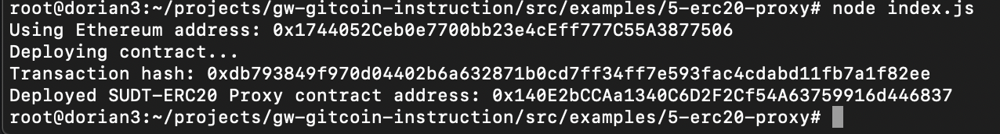
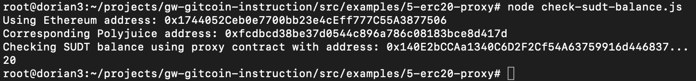

## 1. A screenshot of the console output immediately after deploying smart contract.

## 2. The address of the ERC20 Proxy Contract you deployed (in text format).
0x140E2bCCAa1340C6D2F2Cf54A63759916d446837
## 3. A screenshot of the console output immediately after checking your SUDT balance.

## 4. The Ethereum address that was checked (in text format).
0x1744052Ceb0e7700bb23e4cEff777C55A3877506
