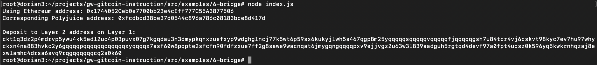

## 1. A screenshot of the console output immediately after you have successfully generated your Deposit Receiver Address.

## 2. Your Deposit Receiver Address (in text format).
ckt1q3dz2p4mdrvp5ywu4kk5edl2uc4p03puvx07g7kgqdau3n3dmypkqnxzuefxyp9wdghglncj77k5wt6p59sx6kukyjlwh5s467qgp8m25yqqqqqsqqqqqvqqqqqfjqqqqqgsh7u84tcr4vj6cskvt98kyc7ev7hu97whyckxn4na883hvkc2y6gqqqqpqqqqqqcqqqqqxyqqqqx7asf60w8pqpte2sfcfn90fdfzxue7ff2g8sawe9wacnqat6jmygqngqqqqpxv9ejjvgz2u63w3l839aadguh5rgtqd4devf97a0fpt4uqsz0k596yq5kwkrnhqzaj8exwlamhc4drsa6svq9rqgqqqqqqcq2s0k60
## 3. The Ethereum address used to generate the Deposit Receiver Address (in text format).
0x1744052Ceb0e7700bb23e4cEff777C55A3877506
## 4. A link to the Etherscan explorer for the successful Force Bridge transaction. This can be found on Force Bridge under History→Succeed.
[https://rinkeby.etherscan.io/tx/0xf7656b535f2e63b4081b4c9ce2f55c987329c44c21e7d25759730377225c0975](https://rinkeby.etherscan.io/tx/0xf7656b535f2e63b4081b4c9ce2f55c987329c44c21e7d25759730377225c0975)
## 5. A link to the Nervos explorer for the successful Force bridge transaction. This can be found on Force Bridge under History→Succeed.
[https://explorer.nervos.org/aggron/transaction/0x993af687a7d7111b472e36edf4d067c74193da59600e988a8ec8bdf7cc500e7f](https://explorer.nervos.org/aggron/transaction/0x993af687a7d7111b472e36edf4d067c74193da59600e988a8ec8bdf7cc500e7f)
